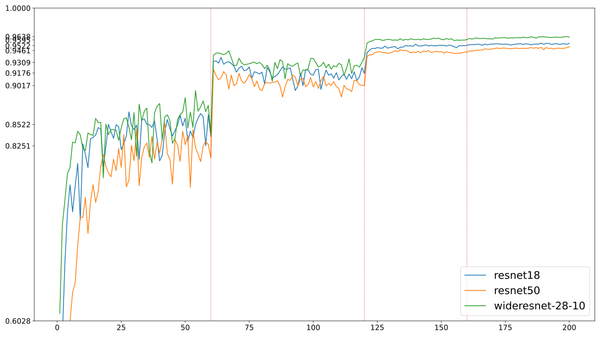

# Baseline Models for Image Classification Tasks

## Models
- VGG[^1]
- ResNet[^2]
- WideResNet[^3]

## Datasets
- CIFAR-10
- [Imagenette](https://github.com/fastai/imagenette)

## Training hyperparater settings

### CIFAR-10 (ResNet/WideResNet)

|setting|optimizer|learning rate|momentum|weight decay|batch size|data normalization|additional details|
|:--:|:--:|:--:|:--:|:--:|:--:|:--:|:--:|
|1|SGD|0.1|0.9|1e-4|128|mean/std|[\*](#additional-details-of-setting-1)|
|2 (default)|SGD|-|-|5e-4|-|-|[\*\*](#additional-details-of-setting-1)|

*"-" indicates hyperparameter remains the same as previous*

#### Additional details of setting 1

*as described in ref.2*

- learning rate  decays with a factor of 0.1 at iterations 32k, 48k until 64k iterations ($\approx$ epochs 80, 120, 160)
- data augmentation:  4-pixel all-edge zero(?) padding followed by 32x32 random cropping
- convolution layer weights are initialized with Kaiming uniform distribution[^4]
- pre-activation, i.e. BN-ReLU-Conv structure[^5]

#### Additional details of setting 2

*as described in ref.3*

- SGD with Nesterov momentum
- learning rate decays with a factor of 0.2 at epochs 60, 120 and 160 epochs until 200 epochs
- data augmentation: replace zero padding with reflection
- dropout rate: 0.3

## Experiment results

### CIFAR-10

| model | test accuracy |
| :--: | :--: |
| ResNet18 | 95.54% |
| ResNet50 | 95.08% |
| WideResNet28-10 | 96.38% |

## Acknowledgement

The model scripts are based on the following repositories:

- [kuangliu/pytorch-cifar](https://github.com/kuangliu/pytorch-cifar)
- [xternalz/WideResNet-pytorch](https://github.com/xternalz/WideResNet-pytorch)

## References

[^1]: Karen Simonyan, et al. "Very Deep Convolutional Networks for Large-Scale Image Recognition." 3rd International Conference on Learning Representations (**ICLR**). 2015.
[^2]: He, Kaiming, et al. "Deep residual learning for image recognition." Proceedings of the IEEE conference on computer vision and pattern recognition (**CVPR**). 2016.
[^3]: Sergey Zagoruyko, et al. "Wide Residual Networks." Proceedings of the British Machine Vision Conference (**BMVC**). BMVA Press, 2016.
[^4]: He, Kaiming, et al. "Delving deep into rectifiers: Surpassing human-level performance on imagenet classification." *Proceedings of the IEEE international conference on computer vision (**ICCV**)*. 2015.
[^5]: He, Kaiming, et al. "Identity mappings in deep residual networks." *European conference on computer vision (**ECCV**)*. Springer, Cham, 2016.
